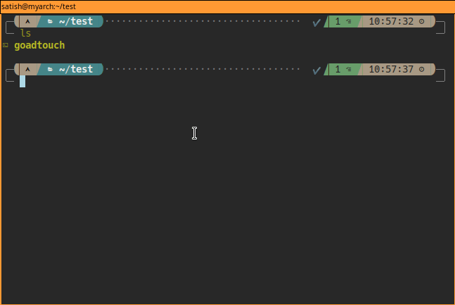

# Go Advanced Touch Program



A command line program to provide a quick scaffolding for a small project.
Similar to `advance-touch` Python project

## Description

The Python program [advance-touch](https://pypi.org/project/advance-touch/) is a great program, but I wanted to create a stand-alone binary using `Go` that could work anywhere. Hence this project.

### Installing

* You need to have `go` installed.  Download the repo, make the binary and put it in your path.
* You can also rename it to something easier like `ad`

## Usage

```sh
goadtouch topdir/{subdir/first.go,fileinsidetopdir.go} hello/anothersubdir/anotherfile.go independentdir/ independentfile

```

## Help 

```
	Program: Advance Touch in Golang
		 ╔════════════════╗
		 ║  Advance Touch ║
		 ║     Usage      ║
		 ╚════════════════╝
 ╭────────────────────────────────────────────────────────────────────╮
 │ $> goadtouch topdir/{subdir/first.go,fileinsidetopdir.go} \        │
 │ hello/anothersubdir/anotherfile.go independentdir/ independentfile │
 ╰────────────────────────────────────────────────────────────────────╯
 Will give us
.
├── hello
│   └── anothersubdir
│       └── anotherfile.go
├── independentdir
├── independentfile
└── topdir
    ├── fileinsidetopdir.go
    └── subdir
        └── first.go
# You can copy this file to your bin directory.
# You can also rename it to something easier like "ad"
```

## Authors

Satish Viswanathan
* [satishvis](https://github.com/satishvis)

## Version History

* 0.1
    * Initial Release

## License

This project is licensed under the [MIT] License - see the [License](LICENSE.md) file for details

## Acknowledgments

Inspiration from
* [advance-touch](https://pypi.org/project/advance-touch/)
